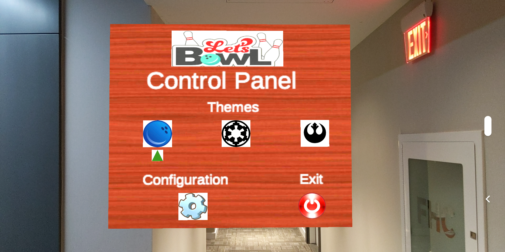
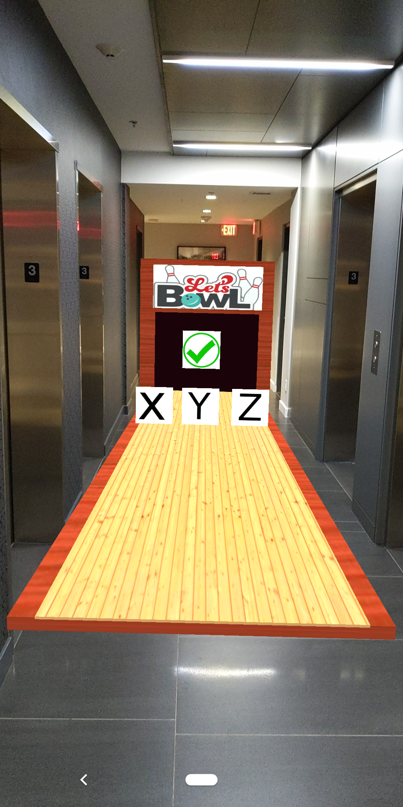
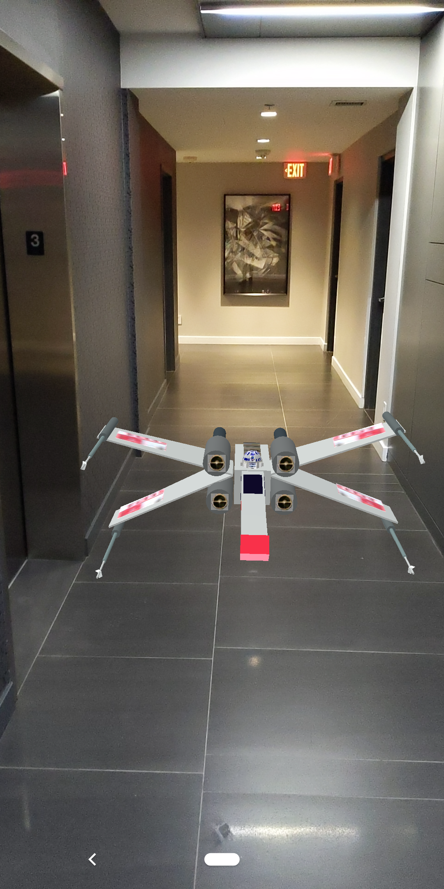
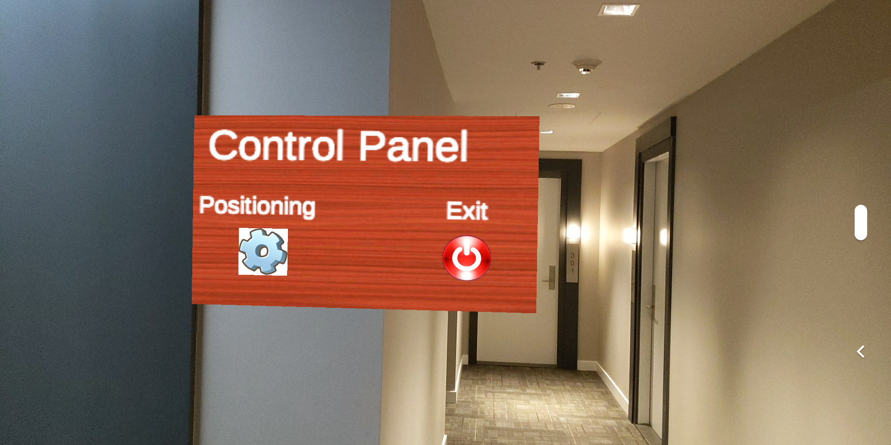
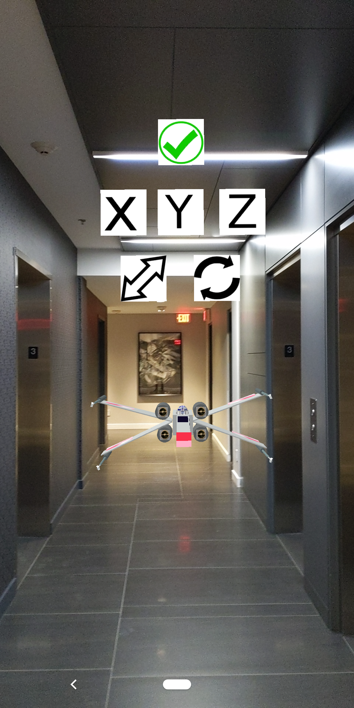
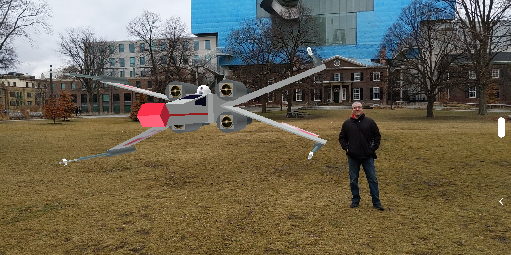
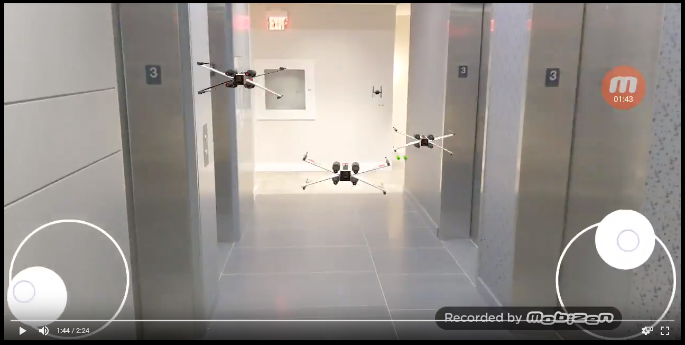
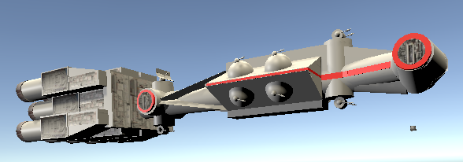
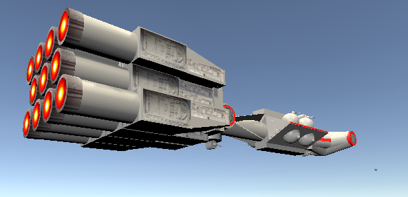
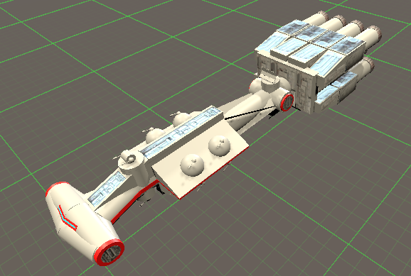

# Overview

This repository contains 2 augmented reality applications:

- A bowling alley with 3 different balls ( normal ball, Star Wars Tie Fighter, Star Wars X-Wing Fighter)
- A Star Wars X-Wing Fighter Showcase

These applications were tested on an Android Google Pixel 3 phone.

I used the [Unity Editor](https://unity.com/products/core-platform), the [C#](https://docs.microsoft.com/en-us/dotnet/csharp/) programming language, and [Google's AR Core API](https://developers.google.com/ar).

## Bowling Alley

This was my first venture into creating an AR application.

The bowling alley will get created in front of where your phone is initially facing.

There is a control panel on your right which allows you to:

- choose 3 different types of bowling balls : default, imperial, rebel
- bring up an XYZ positioning menu to move the alley: front/back, left/right, up/down
- exit the game

Here is a picture of the XYZ positioning menu:

Here is video of the application in action:

[YouTube - Augmented Reality (AR) Bowling Alley with Star Wars Twist](https://www.youtube.com/watch?v=xRjAHuDsP-E) (Best viewed in 720p)

## X-Wing Fighter Showcase

The X-Wing Fighter will get created in front of where your phone is initially facing.

Touching the wings or the blasters will shoot red blaster bolts.

Touching various parts (in front, on top, behind) will play various sounds.

There is a control panel on your right which allows you to:

- bring up an XYZ positioning menu to: **move** the vehicule (front/back, left/right, up/down), to **scale** it smaller or larger, and to **rotate** it (not perfect at the moment)
- exit the game

Here is a picture of the XYZ positioning menu:

Here is a picture of it outside where I'd scaled it higher:

Here is video of the application in action:

[YouTube - Augmented Reality (AR) Star Wars X-Wing Fighter](https://www.youtube.com/watch?v=gzRnFOTOMKY) (Best viewed in 720p)

## Tie Fighter and X-Wing Fighter Shooting Game (In Progress)

Right now I am working on a shooting game. Currently you control a 
Tie Fighter, and you shoot at incoming swarms of X-Wing Fighters.
I have a basic Tantive IV coming out of hyperspace, and letting out a bang. 
Then the Emperor (from inside the Death Star) taunts the rebels, and a swarm
of X-Wing Fighters attacks the Tie Fighter. This process repeats.

[Link to the video](https://photos.app.goo.gl/wNQ6fDZAPorEsQS86)

### Detailed Tantive IV (Just finished)

The basic Tantive IV in the video above will soon be replaced by
the detailed one I just finished.

The tiny spec in some of the pictures above is a Tie Fighter from my shooting game.

## Still In Progress

I originally worked on the bowling alley and X-Wing showcase apps during my Christmas vacation, so they still needs some work.

Since January, I've started to work on the shooting game, and it is still in progress.

Things I couldn't figure out:

- how to use an image with a transparent background in Unity (had to resort to images with white backgrounds)
- how to animate my tie fighter or x-wing fighter. The preview mode would animate perfectly, but in Play mode the coordinates would be all messed up. I gave up.
- I used Plane detection stuff at first (to set my bowling alley on the ground), but had to abandon it because the alley would be angled a tiny bit, and bowling ball would fall off
- how to rotate my x-wing fighter. It doesn't rotate on its axis...it rotates on an axis around 3 meters from its center.

I wasn't focusing on perfect 3D AR textures...just 'good enough' textures. For textures (materials) applied to 3D objects, I just quickly used the RGB color editor to find a close approximation, or I made square panels with portions of images.

I learnt C# on the fly (I am a Java, Javascript, TypeScript, NodeJS programmer by trade.)

I plan on creating a score board on the left (opposite the control panel) to keep proper score of single player or two player game.

## Conclusion

I had a lot of fun using the [Unity Editor](https://unity.com/products/core-platform), the [C#](https://docs.microsoft.com/en-us/dotnet/csharp/) programming language, and [Google's AR Core API](https://developers.google.com/ar) to make these apps.

Being able to export all my work as an android application (and others) is really convenient. :)
