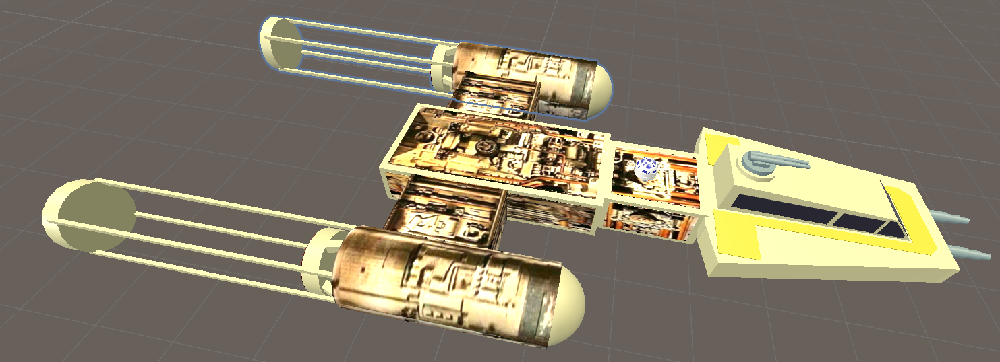
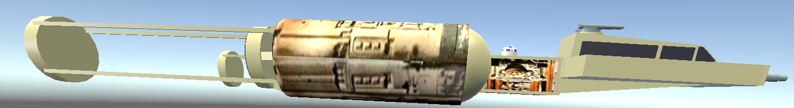
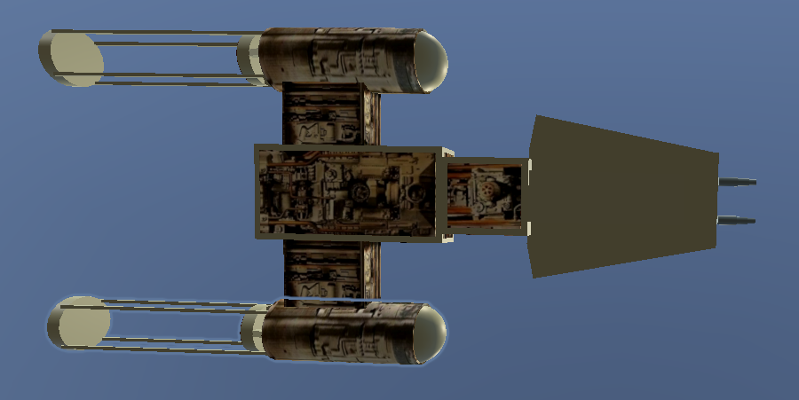
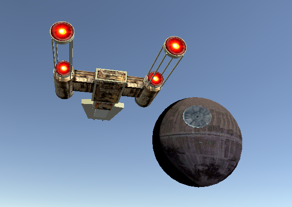

# Overview

This repository contains 3 augmented reality applications:

- A bowling alley with 3 different balls ( normal ball, Star Wars Tie Fighter, Star Wars X-Wing Fighter)
- A Star Wars X-Wing Fighter Showcase
- A Tie Fighter vs X-Wing Fighter shooting game

These applications were tested on an Android Google Pixel 3 phone.

I used the [Unity Editor](https://unity.com/products/core-platform), the [C#](https://docs.microsoft.com/en-us/dotnet/csharp/) programming language, and [Google's AR Core API](https://developers.google.com/ar).

## Bowling Alley

This was my first venture into creating an AR application.

The bowling alley will get created in front of where your phone is initially facing.

There is a control panel on your right which allows you to:

- choose 3 different types of bowling balls : default, imperial, rebel
- bring up an XYZ positioning menu to move the alley: front/back, left/right, up/down
- exit the game

Here is a picture of the XYZ positioning menu:

Here is video of the application in action:

[YouTube - Augmented Reality (AR) Bowling Alley with Star Wars Twist](https://www.youtube.com/watch?v=xRjAHuDsP-E) (Best viewed in 720p)

## X-Wing Fighter Showcase

The X-Wing Fighter will get created in front of where your phone is initially facing.

Touching the wings or the blasters will shoot red blaster bolts.

Touching various parts (in front, on top, behind) will play various sounds.

There is a control panel on your right which allows you to:

- bring up an XYZ positioning menu to: **move** the vehicule (front/back, left/right, up/down), to **scale** it smaller or larger, and to **rotate** it (not perfect at the moment)
- exit the game

Here is a picture of the XYZ positioning menu:

Here is a picture of it outside where I'd scaled it higher:

Here is video of the application in action:

[YouTube - Augmented Reality (AR) Star Wars X-Wing Fighter](https://www.youtube.com/watch?v=gzRnFOTOMKY) (Best viewed in 720p)

## Tie Fighter and X-Wing Fighter Shooting Game (In Progress)

Right now I am working on a shooting game. Currently you control a
Tie Fighter, and you shoot at incoming swarms of various rebel fighters.

The rebel vehicles are spawned from `three` separate `3x3` matrices: one `directly in front` of the Tie Fighter, another from the `front left` and angled on a 45 degree angle, and another from the `front right` and angled on a 45 degree angle.

I have a Tantive IV coming out of hyperspace, and letting out a bang.
Then the Emperor (from inside the Death Star) taunts the rebels, and a swarm
of various rebel fighters attacks the Tie Fighter. 

The left joystick controls the Tie Fighter's movement.

The right joystick controls the Tie Fighter's various attacks:
- Up (Fire green blasts)
- Down (Fire blue ion missle)
- Left (Request for a DeathStar attack on all rebels)
- Right (Request a Cavalry Attack on all rebels: Either 1) a Star Destroyer Attack, or 2) a Boba Fett Attack)

Occasionally the Millenium Falcon appears on screen, stays motionless as it plays various specific bites from various scenes from Episode IV, and then attacks the Tie Fighter with a specific animated sequence, turns around and disappears.

This process repeats.

I haven't designed this game to bring you through an adventure with different levels...I designed this game so I can have a Star Wars battle whenever I felt like it. Oh, and the Tie Fighter can never die, so there's no reason to be stressed out playing this game ;) lol .

[Link to the video](https://www.youtube.com/watch?v=prQ8P_4_pXQ&t=17s)

[Link to video showing Star Destroyer and Death Star attacks](https://photos.app.goo.gl/rwErxJPTzEkVYvXw7)

[Link to video showing Boba Fett ship attack](https://youtu.be/jajerJSvMe8)

[Link to video showing SoundTrack ON/OFF Dialog](https://www.youtube.com/watch?v=hYVGVsCjGds)

### Detailed Tantive IV (Just finished)

I just added this detailed Tantive IV to the video above.

The tiny spec in some of the pictures above is a Tie Fighter from my shooting game.

In the video, however, I made it 1/10 the scale of the pictures.

### Detailed Millennium Falcon

I just added this detailed Millennium Falcon to the game.

The falcon will be invulnerable because it has never exploded in the movies! ;)

[Falcon Hover Test #1](https://www.youtube.com/watch?v=1zfCrN85P5w)
[Falcon Hover Test #2](https://www.youtube.com/watch?v=iILT7N6IbtY)

### Detailed A-Wing

I just added this detailed A-Wing to the game.

### Detailed Y-Wing

I just added this detailed Y-Wing to the game.

### Detailed X-Wing

I just added this detailed X-Wing to the game.

### Detailed X-Wing

I just added this detailed Tie Fighter to the game.

### DeathStar Attack

Move the right joystick to the left, and the DeathStar will destroy every target vehicule with a green DeathStar missle dedicated to each.

### Star Destroyer

Move the right joystick to the right, and the Tie-Fighter calls in a Star Destroyer to come and destroy all the target vehicles on screen.

### Slave I (Boba Fett's ship)

Move the right joystick to the right, and the Tie-Fighter calls in Boba Fett to come and destroy all the target vehicles on screen. I noticed from the movies that Slave I shoot lasers from an upper central area, as well as via the lower gun area, so I added both.

### Soundtrack on/off dialog

The game has a soundtrack on/off dialog. By default the soundtrack is on.

I created it because YouTube will give you a copyright strike if you try to upload an action video with any Star Wars songs playing in the background.

To bring up the soundtrack on/off dialog, `touch` on the DeathStar's disc with your `finger`.

It will display a `volume on` icon if the soundtrack setting is currently set to `on`.

It will display a `volume off` icon if the soundtrack setting is currently set to `off`.

To toggle the setting, `touch` the current icon.

Press the `close icon` in the top right corner to close the dialog.

### Imperial Viper Droid

[Link to the Imperial Viper Droid 360 degree view in Unity Editor](https://www.youtube.com/watch?v=bAHVlAxD198)

## Still In Progress

I am working on this only to amuse myself with Star Wars-related AR stuff.

I wasn't focusing on `'perfect'` 3D AR textures...just `'good enough'` textures. For textures (materials) applied to 3D objects, I just quickly used the RGB color editor to find a close approximation, or I made square panels with portions of images.

I learnt C# on the fly (I am a Java, Javascript, TypeScript, NodeJS, and golang programmer by trade.)

## Upgraded to a new version of Unity Editor

### May 7th, 2021

I started these projects with 2019.2 and my Pixel 3 (with Android 9?).
Then my phone updated a few times during a pause in coding. Now my phone has Android 11.
When I came back to coding, I noticed that the AR portion wasn't working on my phone; the objects weren't overlaying onto what my camera was seeing. The application was deploying with no AR and a black background.

Long story short, I had to perform these steps to get things working again:
- upgraded to Unity Editor 2019.4.25f1 LTS
- set minimum and maximum android to 10 (not 11) in settings (Despite the fact my Pixel 3 is Android 11. The 'Google Play Services for AR' app on my phone complained that my Unity app could not play on my phone.)
- used custom directory for gradle ( e.g. C:/gradle-5.6.4) 
- Created BowlingAlley\Assets\Plugins\Android\launcherTemplate.gradle
- Created BowlingAlley\Assets\Plugins\Android\mainTemplate.gradle
- upgraded to (AR Foundation, AR Subsystems, ARCode XR Plugin) 3.1.10

### Feb 24, 2024

My Google Pixel 3 stopped playing AR applications sometime in summer of 2023. Not sure why.
( Android OS mentioned it no longer supported my phone, so maybe it turned off `Google service for AR` or something :S )

Bought myself a Google Pixel 7 Pro, and tried my existing APK file, and it failed. Didn't know why.
(In retrospect, it is probably because my new phone was ARM64)

In Feb of 2024, I decided to dust off my computer, roll up my sleeves, and get my AR applications running
on my new phone.

#### Migration Effort

- I installed `Unity 2022.3.20f1` and `Android Studio Hedgehog 2023.1.1 Patch 2`
- In Android Studio, I created a hello world application, got the IDE to recognize my phone, and deployed the app to my phone; to ensure all Google Drivers were in place, and the IDE could handle my phone.
- In a fresh directory, I `git clone`-ed my AR project repo
- I opened my old project in Unity 2022, the import took a while, but in the end there were no errors in the Console view, just a few warnings.
- In my Path environment variable, I needed to add: C:\jdk17\bin (yes, a different version than jdk11 below :S)
- In Edit > Preferences > External Tools
    - set JDK: C:\jdk11
    - set SDK: C:\Users\<userName>\AppData\Local\Android\Sdk ( but had to install cmdline-tools version 8.0: C:\Users\<userName>\AppData\Local\Android\Sdk\cmdline-tools\8.0 using `sdkmanager --install "cmdline-tools;8.0"` )
    - set NDK: C:\Users\<userName>\AppData\Local\Android\Sdk\ndk\23.1.7779620 ( I installed this beforehand with `sdkmanager --install "ndk;23.1.7779620"` )
    - kept recommended gradle: C:\Program Files\Unity 2022.3.20f1\Editor\Data\PlaybackEngines\AndroidPlayer\Tools\gradle
- In Edit > Project Settings > Player > Configuration
    - set Scripting Backend: `IL2CPP`
    - set Target Architectures: `ARM64`
- In Edit > Project Settings > Player > Build
    - uncheck all custom gradle templates (main and launcher)
    - as a matter of fact all checkboxes are unchecked
- In Edit > Project Settings > XR Plug-in Management
    - checked Plug-in Providers > Google ARCore ( otherwise my game won't actually be an AR 3D game; just a normal 3D game)

#### File > Build Settings... (Building an APK file)

The first time I tried building an apk, the progress bar took a long time and died. The console.log showed that some particle compile encountered an error 'cannot read magic number'.

A few days after, when I came back to it, the build died and it mentioned I didn't have a keystore set up for Android apk.

Once I created the keystore for android, and ran the build, it finally succeeded.

I had a new apk, and installed it onto my phone.

My AR application was finally running on my Google Pixel 7 Pro! yay!

## Conclusion

I am having a lot of fun using the [Unity Editor](https://unity.com/products/core-platform), the [C#](https://docs.microsoft.com/en-us/dotnet/csharp/) programming language, and [Google's AR Core API](https://developers.google.com/ar) to make these apps.

Being able to export all my work as an android application (and others) is really convenient. :)
