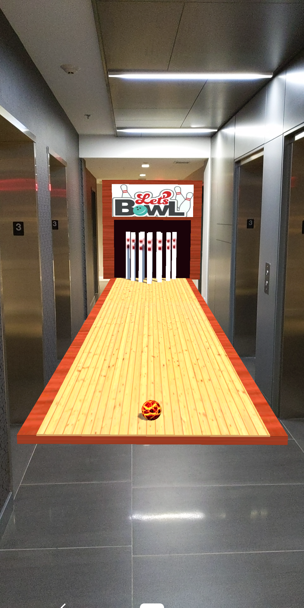

# Overview

This repository contains 3 augmented reality applications:

- A bowling alley with 3 different balls ( normal ball, Star Wars Tie Fighter, Star Wars X-Wing Fighter)
- A Star Wars X-Wing Fighter Showcase
- A Tie Fighter vs X-Wing Fighter shooting game

These applications were tested on an Android Google Pixel 3 phone.

I used the [Unity Editor](https://unity.com/products/core-platform), the [C#](https://docs.microsoft.com/en-us/dotnet/csharp/) programming language, and [Google's AR Core API](https://developers.google.com/ar).

## Bowling Alley

This was my first venture into creating an AR application.

The bowling alley will get created in front of where your phone is initially facing.

There is a control panel on your right which allows you to:

- choose 3 different types of bowling balls : default, imperial, rebel
- bring up an XYZ positioning menu to move the alley: front/back, left/right, up/down
- exit the game

Here is a picture of the XYZ positioning menu:

Here is video of the application in action:

[YouTube - Augmented Reality (AR) Bowling Alley with Star Wars Twist](https://www.youtube.com/watch?v=xRjAHuDsP-E) (Best viewed in 720p)

## X-Wing Fighter Showcase

The X-Wing Fighter will get created in front of where your phone is initially facing.

Touching the wings or the blasters will shoot red blaster bolts.

Touching various parts (in front, on top, behind) will play various sounds.

There is a control panel on your right which allows you to:

- bring up an XYZ positioning menu to: **move** the vehicule (front/back, left/right, up/down), to **scale** it smaller or larger, and to **rotate** it (not perfect at the moment)
- exit the game

Here is a picture of the XYZ positioning menu:

Here is a picture of it outside where I'd scaled it higher:

Here is video of the application in action:

[YouTube - Augmented Reality (AR) Star Wars X-Wing Fighter](https://www.youtube.com/watch?v=gzRnFOTOMKY) (Best viewed in 720p)

## Tie Fighter and X-Wing Fighter Shooting Game (In Progress)

Right now I am working on a shooting game. Currently you control a
Tie Fighter, and you shoot at incoming swarms of X-Wing Fighters.
I have a Tantive IV coming out of hyperspace, and letting out a bang.
Then the Emperor (from inside the Death Star) taunts the rebels, and a swarm
of X-Wing Fighters attacks the Tie Fighter. This process repeats.
Added ion torpedo and ion explosion as well.

[Link to the video](https://www.youtube.com/watch?v=prQ8P_4_pXQ&t=17s)

[Link to video showing Star Destroyer and Death Star attacks](https://photos.google.com/photo/AF1QipPbVE-jMvujBb-Oc38QPX1xYNFJw4h_z_oB8VXy)

### Detailed Tantive IV (Just finished)

I just added this detailed Tantive IV to the video above.

The tiny spec in some of the pictures above is a Tie Fighter from my shooting game.

In the video, however, I made it 1/10 the scale of the pictures.

### Detailed Millennium Falcon

I just added this detailed Millennium Falcon to the game.

The falcon will be invulnerable because it has never exploded in the movies! ;)

[Falcon Hover Test #1](https://www.youtube.com/watch?v=1zfCrN85P5w)
[Falcon Hover Test #2](https://www.youtube.com/watch?v=iILT7N6IbtY)

### Detailed A-Wing

I just added this detailed A-Wing to the game.

### DeathStar Attack

Move the right joystick to the left, and the DeathStar will destroy every target vehicule with a green DeathStar missle dedicated to each.

### Star Destroyer

Move the right joystick to the right, and the Tie-Fighter calls in a Star Destroyer to come and destroy all the target vehicles on screen.

### Slave I (Boba Fett's ship)

Move the right joystick to the right, and the Tie-Fighter calls in Boba Fett to come and destroy all the target vehicles on screen. I noticed from the movies that Slave I shoot lasers from an upper central area, as well as via the lower gun area, so I added both.

## Still In Progress

I originally worked on the bowling alley and X-Wing showcase apps during my Christmas vacation, so they still needs some work.

Since January, I've started to work on the shooting game, and it is still in progress.

Things I couldn't figure out:

- how to use an image with a transparent background in Unity (had to resort to images with white backgrounds)
- I used Plane detection stuff at first (to set my bowling alley on the ground), but had to abandon it because the alley would be angled a tiny bit, and bowling ball would fall off

I wasn't focusing on perfect 3D AR textures...just 'good enough' textures. For textures (materials) applied to 3D objects, I just quickly used the RGB color editor to find a close approximation, or I made square panels with portions of images.

I learnt C# on the fly (I am a Java, Javascript, TypeScript, NodeJS programmer by trade.)

## Upgraded to a new version of Unity Editor

### May 7th, 2021

I started these projects with 2019.2 and my Pixel 3 (with Android 9?).
Then my phone updated a few times during a pause in coding. Now my phone has Android 11.
When I came back to coding, I noticed that the AR portion wasn't working on my phone; the objects weren't overlaying onto what my camera was seeing. The application was deploying with no AR and a black background.

Long story short, I had to perform these steps to get things working again:
- upgraded to Unity Editor 2019.4.25f1 LTS
- set minimum and maximum android to 10 (not 11) in settings (Despite the fact my Pixel 3 is Android 11. The 'Google Play Services for AR' app on my phone complained that my Unity app could not play on my phone.)
- used custom directory for gradle ( e.g. C:/gradle-5.6.4) 
- Created BowlingAlley\Assets\Plugins\Android\launcherTemplate.gradle
- Created BowlingAlley\Assets\Plugins\Android\mainTemplate.gradle
- upgraded to (AR Foundation, AR Subsystems, ARCode XR Plugin) 3.1.10

## Conclusion

I had a lot of fun using the [Unity Editor](https://unity.com/products/core-platform), the [C#](https://docs.microsoft.com/en-us/dotnet/csharp/) programming language, and [Google's AR Core API](https://developers.google.com/ar) to make these apps.

Being able to export all my work as an android application (and others) is really convenient. :)
